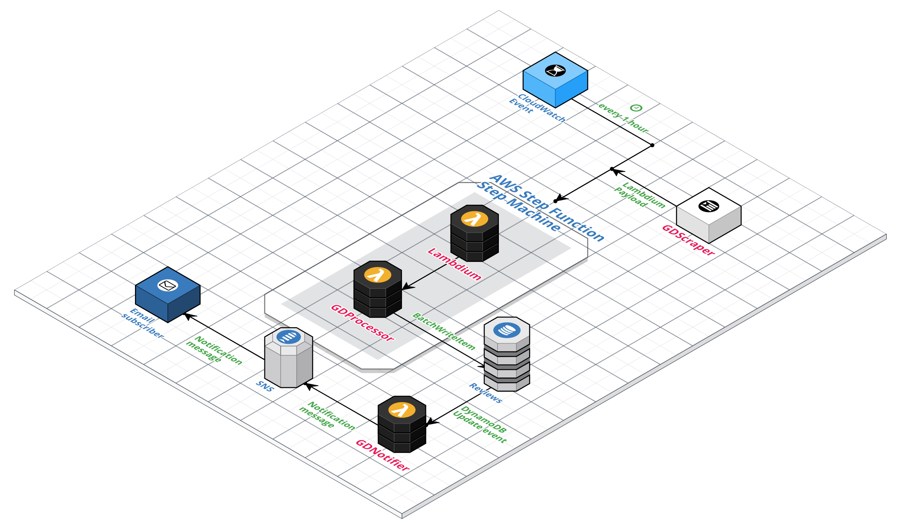

# Glassdoor review scraper



### DOCS BELOW ARE OBSOLETE (I'm migrating the codebase to AWS Lambda)

Run

```bash
npm i
node index.js https://www.glassdoor.com/Reviews/XXXXXXXX-Reviews-YYYYYYYY.htm\?sort.sortType\=RD\&sort.ascending\=false\&filter.employmentStatus\=REGULAR\&filter.employmentStatus\=PART_TIME\&filter.employmentStatus\=UNKNOWN
```

Output

```json
[
  {
    "review": {
      "date": "Jan 2, 2018",
      "summary": "\"Still great company\"",
      "stars": "****",
      "author": "Current Employee - Anonymous Employee",
      "pros": "Still great benefits.",
      "cons": "None.",
      "advice": ""
    }
  },
  {
    "review": {
      "date": "Jan 1, 2018",
      "summary": "\"Great company\"",
      "stars": "****",
      "author": "Current Employee - Anonymous Employee",
      "pros": "Great benefits.",
      "cons": "Too political.",
      "advice": "Fix the politics."
    }
  }
]

```
