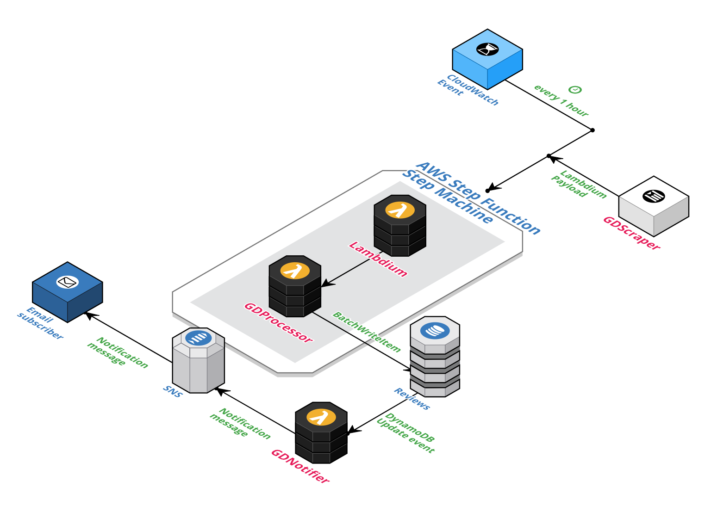

# Glassdoor review scraper concept built on AWS with Node.js



## Fully serverless implementation of a resilient web scraper with SNS notifications

## Lambdium 
It's an [external dependency](https://github.com/czekaj/lambdium) and my custom fork of the original [Lambdium](https://github.com/smithclay/lambdium). I tweaked it to return the stdout (as it was executing the script without returning any value) and always accept `pageUrl` as part of the payload.

Selenium-based scrapers are much more resilient than scraping libraries, like [BeautifulSoup](https://www.crummy.com/software/BeautifulSoup/) or [CheerioJS](https://github.com/cheeriojs/cheerio), as they use an actual browser and execute all JavaScript, effectively disarming anti-scraping scripts.

Lambdium provides a serverless Selenium ChromeDriver packaged as AWS Lambda. It can be invoked with almost any Node.js Selenium script supplied as a JSON payload.

Payload format:
```json
{
	"pageUrl": "https://website_to_scrape/page.html",
	"Base64Script": "TG9yZW0gaXBzdW0gZG9sb3Igc2l0IGFtZXQsIGNvbnNlY3RldHVyIGFkaXBpc2NpbmcgZWxpdCwgc2VkIGRvIGVpdXNtb2QgdGVtcG9yIGluY2lkaWR1bnQgdXQgbGFib3JlIGV0IGRvbG9yZSBtYWduYSBhbGlxdWEuIFV0IGVuaW0gYWQgbWluaW0gdmVuaWFtLCBxdWlzIG5vc3RydWQgZXhlcmNpdGF0aW9uIHVsbGFtY28gbGFib3JpcyBuaXNpIHV0IGFsaXF1aXAgZXggZWEgY29tbW9kbyBjb25zZXF1YXQuIER1aXMgYXV0ZSBpcnVyZSBkb2xvciBpbiByZXByZWhlbmRlcml0IGluIHZvbHVwdGF0ZSB2ZWxpdCBlc3NlIGNpbGx1bSBkb2xvcmUgZXUgZnVnaWF0IG51bGxhIHBhcmlhdHVyLiBFeGNlcHRldXIgc2ludCBvY2NhZWNhdCBjdXBpZGF0YXQgbm9uIHByb2lkZW50LCBzdW50IGluIGN1bHBhIHF1aSBvZmZpY2lhIGRlc2VydW50IG1vbGxpdCBhbmltIGlkIGVzdCBsYWJvcnVtLg=="
}
```

## GDScraper
  - implements the scraping logic
  - generates custom Lambdium payload JSON
  - can be locally run with `npm start`
  - can be tested as a locally deployed Lambda with `npm test`
  - not part of the orchestration workflow (for now)

## GDProcessor
  - accepts the custom Lambdium payload
  - writes all items to DynamoDB using *batch write* mode (one call to DynamoDB instead of ten)

## DynamoDB table
  - stores reviews
  - partition key is set to `reviewId` which is unique and prevents duplicate inserts

## GDNotifier
  - listens for DynamoDB update events
  - publishes each new/updated DynamoDB record as a message into the SNS topic

Using update events is quite efficient. An event is only generated if there are actual changes (not attempts/duplicates). In our case an event will be created only if GDProcessor wrote something **new** to the DynamoDB table.

## AWS SNS topic
  - externally configured (for now)
  - listens for new/updated DynamoDB records
  - pushes every message to an email subscriber
  - completes the workflow

## AWS Step function / State Machine
  - orchestrates Lambdium and GDProcessor
  - takes Lambdium payload as input
  - Lambdium outputs are passed directly to GDProcessor

## CloudWatch Event Rule
  - externally configured (for now)
  - starting point of the workflow
  - new rule launching our State Machine with Lambdium payload on predefined schedule
  - executes the rule every 1 hour
  